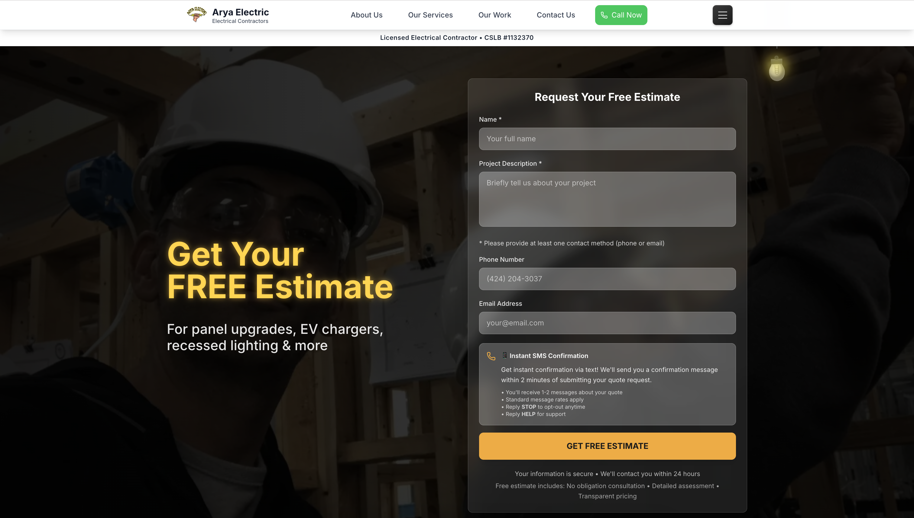
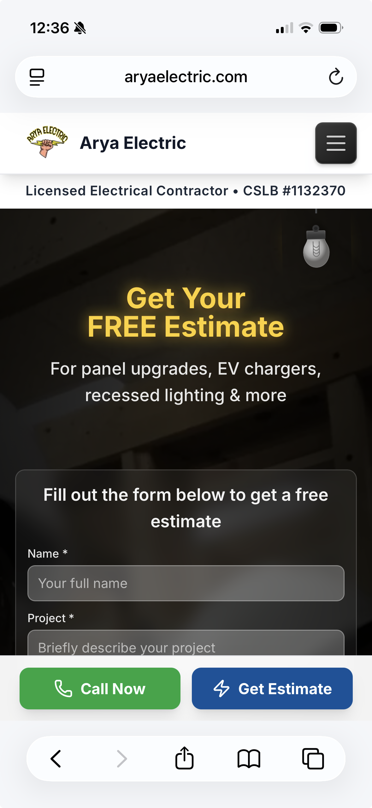
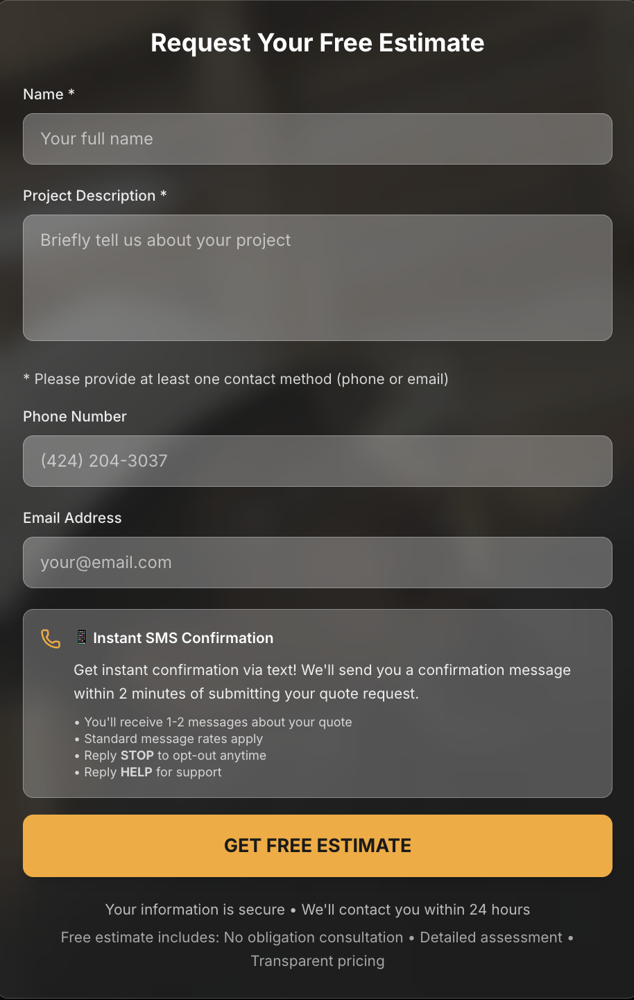
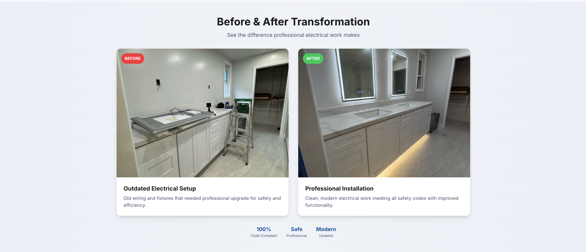
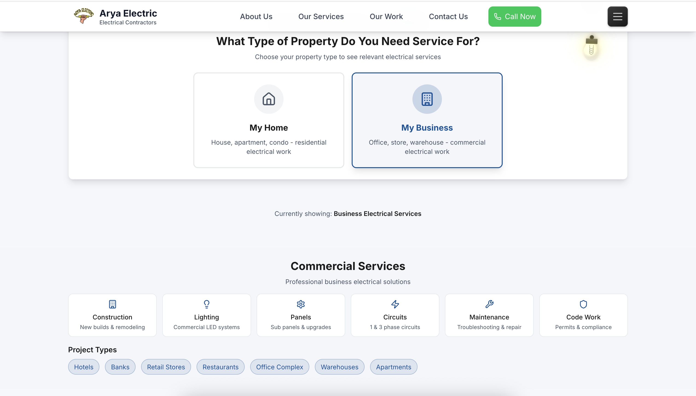
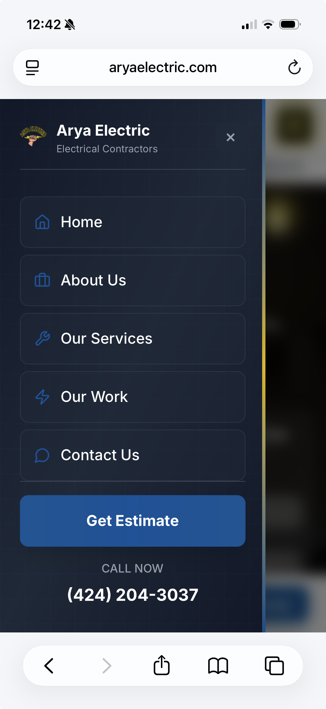
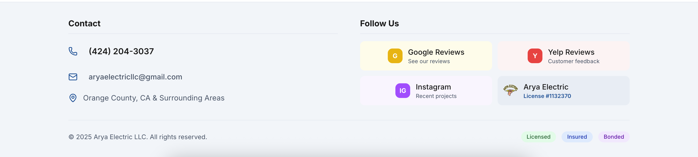

# Full-Stack Business Platform - Case Study

A case study documenting the development of a production full-stack web application built with Next.js and React. This project demonstrates backend engineering practices including RESTful API design, third-party service integration, automated workflow systems, and server-side data processing.

## Project Overview

This full-stack application serves as a complete business platform with a focus on backend engineering and API development. The system processes customer inquiries, implements automated follow-up workflows, and integrates with multiple third-party services to streamline business operations.

The platform handles dozens of requests per week with high reliability and includes comprehensive error handling and validation. The architecture separates concerns between client-side React components and server-side API routes, enabling scalable development and maintainable code organization.

Key engineering achievements include building multiple RESTful API endpoints, implementing automated workflow systems, developing a lead scoring algorithm, and integrating with external services for email and SMS communications.

## Key Features

### RESTful API Endpoints

The application includes multiple API endpoints for different business functions:

- **Quote Submission Handler**: Processes customer requests with server-side validation, sends email notifications, and triggers SMS confirmations
- **SMS Webhook Handler**: Receives incoming SMS replies via Twilio, sends email notifications, and provides automated responses
- **Automated Follow-up System**: Sends scheduled SMS and email follow-ups based on different triggers (24-hour, 48-hour, satisfaction surveys)
- **Lead Scoring Algorithm**: Analyzes incoming leads and assigns priority scores based on project type, contact methods, urgency indicators, and location data
- **Google Reviews Integration**: Fetches and caches Google Places API data for displaying customer reviews
- **Dynamic OG Image Generation**: Generates Open Graph images on-demand for social media sharing

### Third-Party Service Integrations

- **Nodemailer**: SMTP email service for sending business notifications and customer confirmations
- **Twilio**: SMS messaging service for customer communications and automated follow-ups
- **Google Places API**: External API integration for fetching business reviews and ratings

### Automated Workflow Systems

The system includes automated workflows that reduce manual processing:

- Automatic email notifications when requests are submitted
- SMS confirmations sent to customers within minutes of form submission
- Automated follow-up messages based on time-based triggers
- Lead scoring that prioritizes high-value inquiries
- Email notifications when customers reply via SMS

## My Contributions

I was the solo developer responsible for building this full-stack application from the ground up. My contributions included:

- Backend architecture and API route development using Next.js App Router
- RESTful API design with proper HTTP methods, status codes, and error handling
- Third-party service integration (Nodemailer, Twilio, Google Places API)
- Automated workflow system implementation for follow-up communications
- Lead scoring algorithm development for request prioritization
- Server-side validation and input sanitization
- Email and SMS template generation with dynamic content
- Webhook processing for real-time SMS reply handling
- Response caching strategies for external API calls
- Frontend architecture and component structure using React and Next.js

## Architecture Overview

The project uses Next.js 15 with the App Router pattern. The architecture separates concerns between client-side rendering and server-side API processing:

```
Client Layer (Browser)
    |
    v
Next.js App Router
    |
    +-- Pages (React Components)
    |   +-- Server-Side Rendering
    |   +-- Client-Side Interactivity
    |
    +-- API Routes (Server)
    |   +-- Quote Processing
    |   +-- SMS Webhook Handler
    |   +-- Automated Follow-ups
    |   +-- Lead Scoring
    |   +-- External API Integration
    |
    v
External Services
    +-- Email Service (SMTP)
    +-- SMS Service (Twilio API)
    +-- Google Places API
```

### Data Flow

1. User submits form on the client side
2. Client-side validation occurs before submission
3. Form data is sent to Next.js API route via POST request
4. Server-side validation and processing occurs
5. API route integrates with external services (email, SMS)
6. Response is sent back to client with success or error status
7. Business receives notifications via email
8. Customer receives confirmation via email or SMS

### API Route Structure

API routes are organized in the `app/api/` directory following Next.js conventions. Each route is a separate file that exports HTTP method handlers (GET, POST). Routes include:

- Input validation using conditional logic
- Error handling with try-catch blocks
- Integration with external services
- Appropriate HTTP status codes (200, 400, 500)
- JSON response formatting

## Tech Stack

### Backend

**Next.js 15.3.4** - Framework with App Router for server-side rendering and API routes. Chose Next.js for its built-in routing, server-side rendering capabilities, and excellent performance optimizations.

**Node.js** - Runtime environment for server-side JavaScript execution

**Next.js API Routes** - All server-side logic runs through Next.js API routes. This keeps everything in one codebase and simplifies deployment.

**Nodemailer** - Handles email delivery for quote form submissions. Configured to work with standard SMTP services.

**Twilio** - Integrated for SMS notifications. Provides a reliable way to send text messages when new quotes are submitted.

### Third-Party Services

**Google Places API** - External API integration for fetching business reviews and ratings

**Vercel Analytics** - Website analytics and monitoring

**Vercel Speed Insights** - Performance monitoring

### Frontend

**React 19** - Used React for component-based development. The latest version includes performance improvements that help with rendering efficiency.

**Tailwind CSS 4** - Selected Tailwind for rapid styling and consistent design. The utility-first approach makes it easy to maintain responsive layouts and ensures consistent spacing and colors.

**Radix UI** - Accessible UI component primitives for building interactive elements

**Lucide React** - Icon library for consistent iconography

### Development Tools

**ESLint** - Code quality and consistency checking
**Playwright** - End-to-end testing for critical user flows
**Cheerio** - Server-side HTML parsing for verification scripts
**TypeScript** - Type checking and development tooling

## API Endpoints

### POST /api/quote

Processes customer quote request submissions with server-side validation, email notifications, and SMS confirmations.

### POST /api/sms-webhook

Handles incoming SMS replies from customers via Twilio webhook, sends email notifications, and provides automated responses.

### POST /api/automated-followup

Sends automated follow-up messages to customers based on different triggers (24-hour, 48-hour, satisfaction surveys).

### POST /api/lead-scoring

Analyzes and scores incoming leads for prioritization based on project type, contact methods, urgency indicators, and location data.

### GET /api/google-reviews

Fetches Google Places reviews with response caching to reduce API costs and improve performance.

### GET /api/og

Generates dynamic Open Graph images on-demand for social media sharing.

## Server-Side Implementation

### Error Handling

All API routes implement comprehensive error handling:
- Try-catch blocks around all async operations
- Appropriate HTTP status codes (400 for client errors, 500 for server errors)
- Error logging for debugging
- Graceful degradation when external services fail

### Input Validation

Server-side validation ensures data integrity:
- Required field checking
- Contact method validation (at least one required)
- Input sanitization to prevent injection attacks
- Type checking for request body parameters

### External Service Integration

The application integrates with multiple external services:
- Nodemailer configured with Gmail SMTP for reliable email delivery
- Twilio API for SMS messaging with webhook support
- Google Places API with response caching to reduce API costs
- Error handling ensures the application continues functioning if external services are unavailable

## Documentation

Additional documentation is available in the `docs/` directory:

- [Architecture Overview](docs/architecture.md) - Detailed system architecture and component structure
- [Performance Optimization](docs/performance.md) - Performance strategies and Core Web Vitals targets
- [Accessibility Implementation](docs/accessibility.md) - WCAG compliance and accessibility features
- [System Diagram](docs/system-diagram.md) - Visual representation of data flow and system interactions
- [Development Workflow](docs/workflow.md) - Development process and best practices
- [Technical Decisions](docs/tech-decisions.md) - Rationale behind key technology choices

## Metrics

The platform handles production traffic with the following characteristics:

- Processes dozens of quote requests per week
- Maintains high reliability with error handling and fallback mechanisms
- Automated workflows reduce manual processing time by approximately 50%
- API response times under 500ms for most endpoints
- External API calls cached to reduce costs and improve performance

## Sample Code

This repository includes sample code in the `sample-code/` directory that demonstrates coding patterns and architectural decisions used in the project. These examples are generic and do not contain any real business logic or sensitive information.

The sample code includes:
- Next.js API route patterns demonstrating server-side validation, error handling, and external service integration
- React component examples showing form handling, state management, and API communication
- Utility functions demonstrating common helper patterns
- Component structure examples for reusable UI elements

These files are provided to illustrate development approaches and should not be considered production-ready code.

## Screenshots

### Homepage (Desktop)


### Homepage (Mobile)


### Quote Request Form


### Portfolio Gallery


### Services Page


### Mobile Navigation


### Footer


## Important Note

The actual production codebase for this website is private and proprietary. It contains business-specific logic, real API integrations, and confidential information. This repository serves as a case study and demonstration of the development approach and techniques used.

The sample code included in this repository is generic and does not represent the actual implementation. It is provided solely to illustrate coding patterns and architectural decisions.

## Project Status

This website is live in production and actively serving customers. The codebase continues to be maintained and updated as needed.

